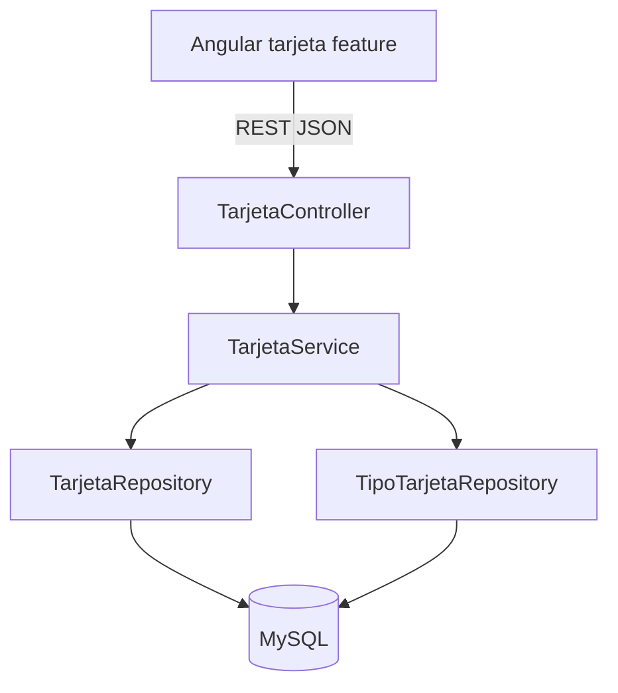

# Design Document — Tipos de Tarjeta / Entidad Tarjeta

---
**Propósito**: Detalle suficiente para implementación consistente entre distintos implementadores, evitando deriva de interpretación.
---

## Overview
Esta feature aporta el registro de tarjetas de débito (entidad *Tarjeta*) en el sistema bancario y la consulta del tipo de una tarjeta existente. El banquero crea tarjetas indicando el nombre del propietario y un tipo opcional que referencia el catálogo *TiposDeTarjetas*; el cliente y el banquero pueden consultar el tipo asociado, que siempre se muestra en MAYÚSCULAS y en negrita.

**Users**: Banquero (crea tarjetas), cliente y banquero (consultan el tipo).
**Impact**: Añade el feature de tarjetas a un sistema greenfield — nueva persistencia, API REST y feature Angular.

### Goals
- G1: Registrar tarjetas con nombre del propietario y tipo opcional referenciado al catálogo.
- G2: Aplicar validaciones: nombre obligatorio, tipo existente en el catálogo y coincidencia insensible a mayúsculas.
- G3: Garantizar identificador único por tarjeta.
- G4: Permitir consultar el tipo de tarjeta mostrado en MAYÚSCULAS y en negrita.

### Non-Goals
- Activación, bloqueo, clave y pagos de tarjeta, operaciones monetarias, cuentas y clientes (otras specs).
- Gestión CRUD del catálogo TiposDeTarjetas (dato de referencia de solo lectura).
- Autenticación y control de acceso por rol.

## Boundary Commitments

### This Spec Owns
- Entidad `Tarjeta` y su persistencia, creación y consulta.
- Reglas de negocio: nombre obligatorio, id único, tipo debe existir en el catálogo, coincidencia ignore-case, tipo opcional.
- Catálogo `tipos_de_tarjetas` como dato de referencia: estructura y seed ('Débito', 'Crédito') necesarios para la asociación de tipo.
- Contrato REST: `POST /api/tarjetas`, `GET /api/tarjetas/{id}`, `GET /api/tipos-tarjetas` (apoyo al formulario).
- Feature Angular `tarjeta`: formulario de creación y vista de consulta del tipo.

### Out of Boundary
- Activación, bloqueo, establecimiento y solicitud de clave, pagos y operaciones monetarias; `cliente`, `cuenta`, `movimiento`, `transferencia`.
- Mutaciones del catálogo de tipos (crear/editar/eliminar tipos de tarjeta).
- Autenticación y autorización por rol (cliente vs banquero).

### Allowed Dependencies
- Spring Web, Spring Data JPA, Bean Validation (Jakarta), MySQL (runtime), Angular HttpClient/Reactive Forms, Bootstrap.
- Dependencia de lectura al catálogo `tipos_de_tarjetas` (dentro del feature `tarjeta`).

### Revalidation Triggers
- Cambio en la forma de `TarjetaRequest`/`TarjetaResponse` o el contrato REST.
- Cambio en las tablas `tarjeta`/`tipos_de_tarjetas` o su FK.
- Cambio en la estrategia de generación del identificador.
- Cambio del seed del catálogo (nuevos/eliminados tipos).
- Cambio de rutas de la API.

## Architecture

### Architecture Pattern & Boundary Map


**Architecture Integration**:
- **Selected pattern**: Layered dentro del feature package `tarjeta` (controller → service → repository → entity).
- **Domain/feature boundaries**: `tarjeta` es dueño de los datos de tarjeta; el catálogo de tipos es referencia de solo lectura dentro del mismo feature.
- **Existing patterns preserved**: N/A (greenfield). Se sigue structure.md (features con solo las capas necesarias).
- **New components rationale**: Controller REST, service de negocio, repositorios JPA, entidades, DTOs y feature Angular.
- **Steering compliance**: Controladores delgados, lógica en servicios, acceso a BD vía repositorios/JPA, paquetes por funcionalidad.

### Technology Stack

| Layer | Choice / Version | Role in Feature | Notes |
|-------|------------------|-----------------|-------|
| Frontend | Angular 21, TypeScript 5.9.x, Bootstrap | Formulario de creación y vista de consulta | MAYÚSCULAS + negrita en presentación |
| Backend | Java 25, Spring Boot 4.0.x | API REST y reglas de negocio | |
| Data | Spring Data JPA / Hibernate, MySQL 8.4 | Persistencia | |
| Runtime | Docker Compose (`./run.sh`), Gradle 9.x | Despliegue | tech.md |

## File Structure Plan

### Directory Structure
```
backend/src/main/java/<base>/tarjeta/
├── controller/
│   └── TarjetaController.java      # Endpoints REST de tarjeta y catálogo
├── service/
│   └── TarjetaService.java         # Reglas de negocio de creación y consulta
├── repository/
│   ├── TarjetaRepository.java      # Acceso JPA a tarjetas
│   └── TipoTarjetaRepository.java  # Acceso JPA al catálogo (findByNombreIgnoreCase)
├── entity/
│   ├── Tarjeta.java                # Entidad persistida con FK al tipo
│   └── TipoTarjeta.java            # Catálogo de tipos (referencia)
└── dto/
    ├── TarjetaRequest.java         # Payload de entrada (nombrePropietario, tipo)
    ├── TarjetaResponse.java        # Payload de salida (id, nombrePropietario, tipo)
    └── TipoTarjetaResponse.java    # Catalogo (id, nombre)
└── exception/
    ├── NombrePropietarioRequeridoException.java  # nombre vacío (1.3)
    ├── TipoTarjetaNoEncontradoException.java     # tipo inexistente (1.4)
    ├── TarjetaNoEncontradaException.java         # consulta de id inexistente (3.1)
    └── TarjetaExceptionHandler.java              # @RestControllerAdvice: mapea excepciones y validación a {codigo, mensaje}
backend/src/main/java/<base>/config/
└── TarjetaDataInitializer.java     # Seed idempotente de Débito/Crédito
backend/src/test/java/<base>/tarjeta/
├── TarjetaServiceTest.java         # Tests unitarios de reglas de negocio
├── TarjetaRepositoryTest.java      # Tests @DataJpaTest
└── TarjetaControllerIT.java        # Tests de API con REST Assured
```

```
frontend/src/app/tarjeta/
├── pages/
│   ├── tarjeta-create/             # Página de creación (formulario)
│   └── tarjeta-detail/             # Página de consulta del tipo
├── components/
│   └── tarjeta-form/               # Formulario reutilizable (nombre + tipo)
├── services/
│   └── tarjeta.service.ts          # Llamadas HTTP al backend
├── models/
│   └── tarjeta.model.ts            # Interfaces Tarjeta, TarjetaRequest
└── tarjeta.routes.ts               # Rutas del feature
```

### Modified Files
- Ninguno (proyecto greenfield; todos los ficheros son nuevos).

## Requirements Traceability

| Requirement | Summary | Components | Interfaces | Data |
|-------------|---------|------------|------------|------|
| 1.1 | Crear tarjeta con nombre y tipo válido | TarjetaService, TarjetaController, tarjeta-form | POST /api/tarjetas | tarjeta insert |
| 1.2 | Tarjeta asociada al catálogo | Tarjeta entity, TipoTarjetaRepository | — | FK tipo_tarjeta_id |
| 1.3 | Nombre obligatorio | TarjetaService | POST validation (400) | NOT NULL |
| 1.4 | Tipo inexistente rechazado | TarjetaService, TipoTarjetaRepository | POST validation (400) | — |
| 2.1 | Identificador único | Tarjeta entity, TarjetaRepository | — | PK autoincremental |
| 2.2 | Duplicado rechazado | TarjetaRepository | — | Constraint de PK |
| 3.1 | Consultar tipo de tarjeta | TarjetaController, TarjetaDetailPage | GET /api/tarjetas/{id} | lectura |
| 3.2 | Tipo en MAYÚSCULAS y negrita | TarjetaDetailPage | frontend display | — |
| 4.1 | Ignorar mayúsculas al crear | TarjetaService, TipoTarjetaRepository | findByNombreIgnoreCase | — |
| 4.2 | Tamaño suficiente para Débito/Crédito | TipoTarjeta | — | VARCHAR(50) |
| 4.3 | Tipo opcional | Tarjeta entity | POST validacion (tipo null ok) | FK nullable |

## Components and Interfaces

### [Backend — feature tarjeta]

#### TarjetaController

| Field | Detail |
|-------|--------|
| Intent | Exponer la API REST de creación y consulta de tarjetas y catálogo |
| Requirements | 1.1, 1.3, 1.4, 3.1 |
| Contracts | API |

**Responsibilities & Constraints**
- Recibir peticiones, aplicar validación de entrada (`@Valid`) y delegar en `TarjetaService`.
- No acceder a repositorios ni contener lógica de negocio.

**Dependencies**
- Inbound: cliente HTTP Angular (P0)
- Outbound: `TarjetaService` — operaciones de negocio (P0)

**API Contract**
| Method | Endpoint | Request | Response | Errors |
|--------|----------|---------|----------|--------|
| POST | /api/tarjetas | `TarjetaRequest` | 201 `TarjetaResponse` | 400 |
| GET | /api/tarjetas/{id} | — | 200 `TarjetaResponse` | 404 |
| GET | /api/tipos-tarjetas | — | 200 `[TipoTarjetaResponse]` | — |

**Implementation Notes**
- Validación de entrada con Jakarta Bean Validation (`@NotBlank` en nombrePropietario).
- Riesgo: micro-cambios de anotaciones en Spring Boot 4.0.x; verificar durante implementación.

#### TarjetaService

| Field | Detail |
|-------|--------|
| Intent | Reglas de negocio de creación y consulta de tarjetas |
| Requirements | 1.1–1.4, 2.1, 3.1, 4.1, 4.3 |
| Contracts | Service |

**Responsibilities & Constraints**
- `crearTarjeta(request)`: rechaza nombrePropietario vacío; resuelve el tipo por nombre ignorando mayúsculas (si se indica); si no existe, rechaza; persiste; devuelve `TarjetaResponse`.
- `obtenerTarjeta(id)`: devuelve la tarjeta o lanza error 404.
- Unicidad del id delegada a la PK autoincremental.

**Dependencies**
- Inbound: `TarjetaController` (P0)
- Outbound: `TarjetaRepository` — persistencia de tarjetas (P0); `TipoTarjetaRepository` — resolución del catálogo (P0)

**Service Interface**
```java
public class TarjetaService {
    TarjetaResponse crearTarjeta(TarjetaRequest request);   // lanza error de validacion si nombre vacio o tipo inexistente
    TarjetaResponse obtenerTarjeta(Long id);                // lanza 404 si no existe
    List<TipoTarjetaResponse> listarTiposTarjeta();         // catálogo completo, apoyo al formulario (añadido en 2.2)
}
```
- Preconditions: request con `nombrePropietario` no vacío; `tipo` (opcional) debe existir en catálogo.
- Postconditions: tarjeta persistida con id único y tipo asociado (si existe).
- Invariants: nombrePropietario obligatorio; tipo opcional; id único.

**Implementation Notes**
- Integración: repositorios Spring Data JPA.
- Validación: `findByNombreIgnoreCase` para AC 4.1.
- Riesgos: coincidencia ignore-case con acentos; cubierta en tests.

#### TarjetaRepository / TipoTarjetaRepository

| Field | Detail |
|-------|--------|
| Intent | Acceso JPA a tarjetas y al catálogo |
| Requirements | 1.2, 1.4, 2.1, 2.2, 4.1 |
| Contracts | State |

**Responsibilities & Constraints**
- `TarjetaRepository`: `save`, `findById`.
- `TipoTarjetaRepository`: `findByNombreIgnoreCase`, `findAll`.

**Dependencies**
- Outbound: entidades JPA (P0); MySQL (P0)

**Implementation Notes**
- `TipoTarjetaRepository.findByNombreIgnoreCase(nombre)` cubre AC 4.1.
- Rechazo de duplicado de id por constraint de PK (AC 2.2).

#### TarjetaDataInitializer

| Field | Detail |
|-------|--------|
| Intent | Sembrar el catálogo si está vacío |
| Requirements | 1.4, 4.2 |
| Contracts | Batch |

**Responsibilities & Constraints**
- En arranque, si `tipos_de_tarjetas` está vacío, inserta 'Débito' y 'Crédito'.
- Idempotente: no duplica si ya hay datos.

**Dependencies**
- Outbound: `TipoTarjetaRepository` (P0)

**Implementation Notes**
- `CommandLineRunner` de Spring Boot.

### [Frontend — feature tarjeta]

| Component | Domain/Layer | Intent | Req Coverage | Key Dependencies | Contracts |
|-----------|--------------|--------|--------------|------------------|-----------|
| TarjetaCreatePage | UI | Crear tarjeta vía formulario | 1.1, 1.3, 1.4 | tarjeta-form, tarjeta.service | API |
| TarjetaDetailPage | UI | Consultar el tipo de la tarjeta | 3.1, 3.2 | tarjeta.service | API |
| TarjetaFormComponent | UI | Formulario nombre + tipo (reeutilizable) | 1.1 | TarjetaCreatePage | State |
| TarjetaService | Data access | Llamadas HTTP REST | 1.1, 3.1 | HttpClient | API |
| TarjetaModel | Model | Tipos de datos (interfaces) | — | — | State |

**Implementation Notes**
- `TarjetaDetailPage` muestra el tipo con `text-transform: uppercase` y `font-weight: bold` (AC 3.2).
- Interfaces TypeScript sin `any`; `HttpErrorResponse` tipado para mensajes de validación.
- Alias de ruta `@/` para imports internos cuando esté configurado.

## Data Models

### Domain Model
- Agregado raíz: `Tarjeta` (id, nombrePropietario, tipo). `TipoTarjeta` es valor de referencia del catálogo.
- Invariantes: `nombrePropietario` no vacío; `tipo` opcional y debe existir en el catálogo (ignore-case).

### Logical Data Model
- `Tarjeta` [1..*] → [0..1] `TipoTarjeta` (FK nullable).

### Physical Data Model
Tabla `tipos_de_tarjetas`:
- `id` BIGINT PK AUTO_INCREMENT
- `nombre` VARCHAR(50) NOT NULL UNIQUE
- Seed inicial: ('Débito'), ('Crédito')

Tabla `tarjeta`:
- `id` BIGINT PK AUTO_INCREMENT
- `nombre_propietario` VARCHAR(150) NOT NULL
- `tipo_tarjeta_id` BIGINT NULL FK → `tipos_de_tarjetas.id`
- Índice sobre `tipo_tarjeta_id`

### Data Contracts & Integration
**API Data Transfer**
- `TarjetaRequest` (JSON): `{ "nombrePropietario": string, "tipo": string | null }` — tipo insensible a mayúsculas, debe existir en catálogo.
- `TarjetaResponse` (JSON): `{ "id": number, "nombrePropietario": string, "tipo": string | null }` — `tipo` es el nombre canónico del catálogo.
- `TipoTarjetaResponse` (JSON): `{ "id": number, "nombre": string }`.

## Error Handling

### Error Strategy
- Validación de entrada y reglas de negocio detectadas en el servicio; errores devueltos con cuerpo `{ "codigo": string, "mensaje": string }`.

### Error Categories and Responses
- **User Errors (4xx)**:
  - 400 — nombrePropietario vacío: "El nombre del propietario es obligatorio".
  - 400 — tipo no encontrado en el catálogo: "El tipo de tarjeta no existe".
  - 404 — tarjeta no encontrada: "Tarjeta no encontrada".
- **System Errors (5xx)**: fallo genérico con mensaje neutro; log del detalle.

### Monitoring
- Logging de creación/consulta y de rechazos de validación en `TarjetaService`.

## Testing Strategy

### Unit Tests — TarjetaServiceTest
1. Crear tarjeta con nombre y tipo válido → persistida con id asignado (1.1, 2.1).
2. nombrePropietario vacío → rechazo con error de validación (1.3).
3. Tipo 'débito' y 'DÉBITO' → coincide con catálogo (4.1).
4. Tipo inexistente → rechazo (1.4).
5. Tipo null → creación permitida (4.3).
6. Persistencia con id duplicado → rechazo por constraint (2.2).

### Integration Tests — TarjetaControllerIT (REST Assured)
1. POST /api/tarjetas con datos válidos → 201 y respuesta con tipo (1.1, 1.2).
2. POST /api/tarjetas con tipo inválido → 400 (1.4).
3. GET /api/tarjetas/{id} → 200 con tipo (3.1).
4. GET /api/tipos-tarjetas → 200 con Débito y Crédito.
5. GET /api/tarjetas/{id} inexistente → 404.

### Repository Tests — TarjetaRepositoryTest (@DataJpaTest)
1. `findByNombreIgnoreCase` insensible a mayúsculas (4.1).
2. Persistencia de Tarjeta con FK al tipo (1.2).

### Frontend
1. `tarjeta.service` mapea respuestas REST tipadas.
2. `tarjeta-detail` renderiza el tipo en MAYÚSCULAS y negrita (3.2).
3. `tarjeta-form` envía `TarjetaRequest` correcto y muestra errores de validación.

## Security Considerations
- Sin autenticación en esta feature (fuera de alcance); los datos expuestos son de bajo riesgo (nombre del propietario y tipo). Mantener fuera de logs sensibles el payload completo.

## Migration Strategy
- Greenfield: esquema creado por JPA + seed idempotente (`TarjetaDataInitializer`). Sin migración de datos previa.